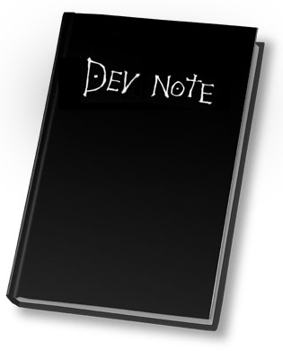

# Dev Note

Appunti personali riguardanti il mondo dello Sviluppo Software; riassunti da testi autorevoli, snippets, tutto rigorosamente 
in ordine sparso

- **[Collections Framework](notes/Collections-Framework.md)**, note su collezioni e strutture dati in Java 
*#map, #list, #array, #arraylist, #queue, ...*

- **[Lambda Expression](notes/Lambda-Expressions.md)** utilizzo e teoria, il package `java.util.function` 
*#lambda, #functional, #jdk8*

