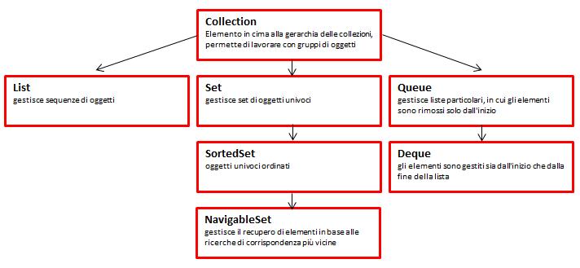
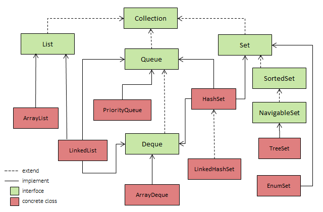

###### Appunti tratti da "Java, The Complete Reference, Ninth Edition" di Herbert Schildt. ######

# 1. Caratteristiche Principali
- Il framework è costruito su un **set di interfacce** standard, alcune delle quali implementate in classi già utilizzabili così come sono.
- Comprende meccanismi per l'integrazione con gli **array** standard
- Sono definiti degli **algoritmi** che operano sulle collezioni attraverso metodi per la manipolazione dei dati
- Comprende l'interfaccia **Iterator** che offre l'accesso agli elementi di una collezione
- Definisce una serie di **interfacce map** e relative classi che definiscono dati come chiave/valore, che per quanto facciano parte del 
framework non sono propriamente delle collezioni, ma hanno una forte relazione con esse.
- Supportano i **Generics** e grazie all'autoboxing/unboxing anche i tipi primitivi

# 2. Panoramica sulle interfacce standard

|Interfaccia | Descrizione |
|------------|:------------|
|Collection  | Elemento in cima alla gerarchia delle collezioni, permette di lavorare con gruppi di oggetti |
|List        | Estende ```Collection```, gestisce sequenze di oggetti |
|Set         | Estende ```Collection```, gestisce set di oggetti univoci |
|Queue       | Estende ```Collection```, gestisce liste particolari, in cui gli elementi sono rimossi solo dall'inizio |
|Deque       | Estende ```Queue```, gli elementi sono gestiti sia dall'inizio che dalla fine della lista |
|SortedSet   | Estende ```Set```, oggetti univoci ordinati |
|NavigableSet| Estende ```SortedSet```, gestisce il recupero di elementi in base alle ricerche di corrispondenza più vicine



In aggiunta a queste interfacce, Collections usa anche le interfacce 
- ```Comparator```: per confrontare due oggetti
- ```Iterator```, ```ListIterator```, ```Spliterator```: enumerano gli oggetti all'interno di una collezione
- ```RandomAccess``` : indica che una lista supporta l'accesso casuale ai propri elementi

## 2.1 Collection
> L'interfaccia [Collection](https://docs.oracle.com/javase/9/docs/api/java/util/Collection.html) è il fondamento su cui si basa l'intero framework, in quanto ogni classe che definisce una
collezione deve implementare tale interfaccia.
È definita come 
>```
>interface Collection<E>
>```
> ed estende ```Iterator```. Collection dichiara i metodi principali di tutte le collezioni e per questo motivo sono degni di essere
> memorizzati e capiti nella loro interezza

<table><tr><th>Metodo</th><th>Descrizione</th>
<tr><td nowrap>boolean add(E obj)</td><td>aggiunge obj alla collezione, restituisce true se l'oggetto è stato aggiunto, false se obj era già presente e la collezione non ammette duplicati</td></tr>
<tr><td nowrap>boolean addAll( Collection&lt? extend E&gt c )</td><td>aggiunge tutti gli elementi di c alla collezione, restituisce true se la collezione viene modificata, altrimenti false</td></tr>
<tr><td nowrap>void clear()</td><td>rimuote tutti gli elementi dalla collezione</td></tr>
<tr><td nowrap>boolean contains(Object obj)</td><td>restituisce true se obj è un elemento della collezione, altrimenti false</td></tr>
<tr><td nowrap>boolean containsAll( Collection&lt?&gt c )</td><td>restituisce true se la collezione contiene tutti gli elementi di c, altrimenti false</td></tr>
<tr><td nowrap>boolean equals(Object obj)</td><td>restituisce true se la collezione è uguale a obj</td></tr>
<tr><td nowrap>int hashCode()</td><td>restituisce l'hashcode della collezione</td></tr>
<tr><td nowrap>boolean isEmpty()</td><td>restituisce vero se la collezione è vuota, altrimenti false</td></tr>
<tr><td nowrap>Iterator<E> iterator()</td><td>restituisce un iterator per la collezione</td></tr>
<tr><td nowrap>default Stream<E> parallelStream()</td><td> restituisce uno stream che utilizza la collezione come sorgente per i propri elementi. Se possibile, lo stream utilizzerà il parallelismo per incrementare le prestazioni ( JDK8 )</td></tr>
<tr><td nowrap>boolean remove(Object obj)</td><td>rimuove una istanza di obj dalla collezione, restituisce true se l'oggetto viene effettivamente rimosso, false in caso contrario</td></tr>
<tr><td nowrap>boolean removeAll(Collection&lt?&gt c)</td><td>rimuove dalla collezione tutti gli elementi di c</td></tr>
<tr><td nowrap>default boolean removeIf( Predicate&lt? super E&gt p )</td><td>rimuove dalla collezione gli elementi che soddisfano la condizione p</td></tr>
<tr><td nowrap>boolean retainAll(Collection&lt?&gt c)</td><td>rimuove dalla collezione tutti gli elementi che non sono presenti in c</td></tr>
<tr><td nowrap>int size()</td><td>restituisce il numero di elementi della collezione</td></tr>
<tr><td nowrap>default Spliterator<E> spliterator()</td><td>restituisce uno spliterator per la collezione</td></tr>
<tr><td nowrap>default Stream<E> stream()</td><td>restituisce uno stream che utilizza la collezione come sorgente per i propri elementi. Lo stream è sequenziale.</td></tr>
<tr><td nowrap>Object[] toArray()</td><td>restituisce un array che contiene tutti gli elementi della collezione</td></tr>
<tr><td nowrap><T> T[] toArray(T array[])</td><td>restituisce un array che contiene tutti gli elementi della collezione. Se la dimensione di array è uguale a quella della collezione, gli elementi sono copiati in array; se è inferiore, viene creato un nuovo array; se superiore, le posizioni eccedenti sono inizializzate a null</td></tr>
</table>

## 2.2 List
>L'interfaccia [List](https://docs.oracle.com/javase/9/docs/api/java/util/List.html) estende `Collection` e descrive
>una collezione come una sequenza di elementi non ordinati. Si può inserire o accedere agli elementi attraverso la loro posizione nella
>lista, partendo dalla posizione 0 ( zero ); una List può contenere elemeneti duplicati.<br/>
>È definita come 
>```
>interface List<E>
>```
> Aggiunge i propri metodi come descritti nella documentazione

## 2.3 Set
>L'interfaccia [Set](https://docs.oracle.com/javase/9/docs/api/java/util/Set.html) estende `Collection`
>e rappresenta un set di oggetti univoci, ovvero non permette duplicati al proprio interno.<br/>
>È definita come 
>```
>interface Set<E>
>```
> Aggiunge i propri metodi come descritti nella documentazione

## 2.4 SortedSet
>L'interfaccia [SortedSet](https://docs.oracle.com/javase/9/docs/api/java/util/SortedSet.html) estende `Set` descrivendo
>un set ordinato in modo ascendente.<br/>
>È definita come 
>```
>interface SortedSet<E>
>```
> Aggiunge i propri metodi come descritti nella documentazione

## 2.5 NavigableSet
>L'interfaccia [NavigableSet](https://docs.oracle.com/javase/9/docs/api/java/util/NavigableSet.html) estende `SortedSet` e
>descrive una collezione che supporta il recupero degli oggetti basato su una ricerca di corrispondenza più vicina al valore passato.<br/>
>È definita come 
>```
>interface NavigableSet<E>
>```
> Aggiunge i propri metodi come descritti nella documentazione

## 2.6 Queue
>L'interfaccia [Queue](https://docs.oracle.com/javase/9/docs/api/java/util/Queue.html) estende `Collection` e descrive una collezione
>di tipo coda, spesso rappresentata come una lista first-in, first-out. Gli elementi possono essere rimossi solo dall'inizio della coda.<br/>
>È definita come 
>```
>interface Queue<E>
>```
> Aggiunge i propri metodi come descritti nella documentazione

## 2.7 Deque
>L'interfaccia [Deque](https://docs.oracle.com/javase/9/docs/api/java/util/Deque.html) estende `Queue` descrivendo una collezione di
>tipo coda in cui gli elementi possono essere presi da entrambi i capi, quindi first-in, first-out oppure last-in, first-out.
>Comprende i metodi `push()` e `pop()` che permettono a Deque di rappresentare uno *stack*.<br/>
>È definita come 
>```
>interface Deque<E>
>```
> Aggiunge i propri metodi come descritti nella documentazione

# 3. Panoramica sulle classi standard di Collection
Dopo aver descritto le interfacce per le collezioni, si passa alle classi standard che le implementano. Alcune classi
forniscono una completa implementazione e possono essere utilizzate da subito, altre sono astratte e forniscono l'ossatura
per la creazione di collezioni reali

|Classe | Descrizione |
|------------|:------------|
|AbstractCollection | implementa quasi interamente l'interfaccia `Collection` |
|AbstractList | estende `AbstractCollection` e implementa quasi interamente l'interfaccia `List` |
|AbstractQueue| estende `AbstractCollection` e implementa parte dell'interfaccia `Queue` |
|AbstractSet | estende `AbstractCollection` ed implementa quasi interamente l'interfaccia `Set` |
|AbstractSequentialList | estende `AbstractList` per collezioni che usano l'accesso sequenziale piuttosto che quello casuale agli elementi |
|[ArrayList](https://docs.oracle.com/javase/9/docs/api/java/util/ArrayList.html) | estende `AbstractList` ed implementa l'interfaccia `List`. Descrive la struttura dati [array](https://it.wikipedia.org/wiki/Array) che in questo caso può **crescere** secondo le necessità, al contrario dei normali array che hanno una dimensione fissa. |
|[LinkedList](https://docs.oracle.com/javase/9/docs/api/java/util/LinkedList.html) | estende `AbstractSequentialList` e implementa le interfacce `List`, `Deque`, `Queue` fornendo l'implementazione di una [lista concatenata](https://it.wikipedia.org/wiki/Lista_concatenata) |
|[HashSet](https://docs.oracle.com/javase/9/docs/api/java/util/HashSet.html) | estende `AbstractSequentialList` e implementa l'interfaccia `Set`, `Deque`, `Queue` fornendo l'implementazione di una [hash table](https://it.wikipedia.org/wiki/Hash_table). L'informazione della chiave per determinare l'**univocità** degli elementi è l'hashcode e non è direttamente accessibile. Il vantaggio dell'hashing è che il tempo di esecuzione per l'accesso agli elementi è **costante** anche per set molto grandi. HashSet non garantisce l'ordinamento degli elementi, e nel caso occorra, meglio utilizzare `TreeSet` |
|[LinkedHashSet](https://docs.oracle.com/javase/9/docs/api/java/util/LinkedHashSet.html) | estende `HashSet` mantenendo una lista concatenata per gli elementi. Ciò significa che iterando sulla collezione gli elementi sono restituiti secondo l'**ordine** in cui sono stati inseriti |
|[TreeSet](https://docs.oracle.com/javase/9/docs/api/java/util/TreeSet.html) | estende `AbstractSet` ed implementa l'interfaccia `NavigableSet`. Crea una collezione che utilizza un [albero](https://it.wikipedia.org/wiki/Albero_(informatica))  per memorizzare i dati. Gli oggetti sono mantenuti in **ordine** ascendente ed accedervi è una operazione piuttosto **veloce**, per questo TreeSet è una ottima scelta per conservare informazioni che vanno reperite velocemente.|
|[PriorityQueue](https://docs.oracle.com/javase/9/docs/api/java/util/PriorityQueue.html) | estende `AbstractQueue` ed implementa l'interfaccia `Queue` per supportare una [coda di priorità](https://it.wikipedia.org/wiki/Coda_di_priorit%C3%A0) in base al `comparator` della coda. Se non è specificato nessun **comparator**, la coda viene creata con il comparator di default del tipo di dato in essa contenuto, in ordine ascendente ( quindi la testa della coda contiene il valore più piccolo ). Nota: nonostante sia possibile iterare su questo tipo di collezione, l'ordine non è garantito usando una iterazione; per il corretto uso, utilizzare i metodi offerti da `Queue` |
|[ArrayDeque](https://docs.oracle.com/javase/9/docs/api/java/util/ArrayDeque.html) | estende `AbstractCollection` ed implementa l'interfaccia `Deque` creando una [coda](https://it.wikipedia.org/wiki/Coda_(informatica)) a dimensioni dinamiche |
|[EnumSet](https://docs.oracle.com/javase/9/docs/api/java/util/EnumSet.html) | estende `AbstractSet` e implementa l'interfaccia `Set` per essere utilizzata con elementi `enum` |



# 4. Iterator e altre interfacce del framework

L'interfaccia [Iterator](https://docs.oracle.com/javase/9/docs/api/java/util/Iterator.html) permette di scorrere gli elementi di una collezione. `ListIterator` estente `Iterator` e permette l'attraversamento bidirezionale di una collezione e la modifica degli elementi in essa contenuti. Da ogni collezione è possibile creare un Iterator/ListIterator attraverso il metodo `iterator()` dell'interfaccia `Collection` come nell'esempio:

```java
Iterator<Object> iterator = mycollection.iterator();
while( iterator.hasNext() ){
  Object e = iterator.next();
  System.out.println( e.toString() );
}
```

Se non serve modificare gli elementi, o lo scorrimenti in ordine inverso, è sufficiente Iterator e per esso esiste un alternativa spesso più conveniente per scorrere gli elementi in lettura: il ciclo **For-Each**

```java
for( Object o : mycollection ){
  //do reading stuff
}
```

Con Java 8 viene introdotto [Spliterator](https://docs.oracle.com/javase/9/docs/api/java/util/Spliterator.html) che si differenzia per l'abilità di supportare l'esecuzione parallela ed un approccio più moderno basato sulla sintassi lambda e gli stream.

```Java
Spliterator<Object> spliterator = mycollection.spliterator();
while( spliterator.tryAdvance( (o) -> System.out.println( o.toString() ) );
```

# 5. Map
L'interfaccia [Map](https://docs.oracle.com/javase/9/docs/api/java/util/Map.html) definisce la natura di un oggetto *map*, ovvero una struttura che contiene elementi con una associazione chiave/valore, in un la ricerca e l'accesso viene fatto attraverso l'oggetto *chiave*. Tale chiave è univoca nella collezione, mentre i valori possono essere duplicati. Non implementa `Iterator`

|Interfaccia | Descrizione |
|------------|:------------|
|Map  | Maps con chiave univoca associata ad un valore |
|Map.Entry | Descrive un elemento ( la coppia key/value ) contenuto in Map ed è una classe interna a Map |
|SortedMap | estende `Map`, mantenendo le chiavi in ordine ascendente |
|NavigableMap | estende `SortedMap` per la ricerca di entry basata sulla corrispondenza più vicina |

Nonostante Map faccia parte del *Collections Framework*, le maps *non sono collezioni poichè non implementano l'interfaccia `Collection`*.
In ogni caso, è possibile ottenere una collection da una map attraverso il metodo `entrySet()` che restituisce un `Set` contenente gli elementi della map. Modificare la collezione ottenuta con `map.entrySet()` modifica anche la map originaria ed è per questo legate che Map appartiene al framework

## 5.1 Le classi di Map

Queste sono le classi che forniscono l'implementazione dell'interfaccia Map

|Classe | Descrizione |
|------------|:------------|
|AbstractMap | è la superclasse per tutte le classi concrete e implementa buona parte di `Map` |
|[EnumMap](https://docs.oracle.com/javase/9/docs/api/java/util/EnumMap.html) | estende `AbstractMap` e implementa l'interfaccia `Map`, specifica per l'utilizzo di oggetti enum come chiavi |
|[TreeMap](https://docs.oracle.com/javase/9/docs/api/java/util/TreeMap.html) | estende `AbstractMap` e implementa l'interfaccia `NavigableMap` per l'utilizzo di map con strutture ad albero. Gli elementi sono ordinati in ordine ascendente di chiave, poiché implementa una interfaccia che discende da SortedMap |
|[HashMap](https://docs.oracle.com/javase/9/docs/api/java/util/HashMap.html) | estende `AbstractMap` e implementa l'interfaccia `Map` per l'utilizzo di hash table il cui tempo di accesso agli elementi è costante anche per set molto grandi. L'ordine di inserimento non corrisponde a nessun ordinamento interno, in altre parole, gli elementi non sono ordinati.|
|[LinkedHashMap](https://docs.oracle.com/javase/9/docs/api/java/util/LinkedHashMap.html) | estende `HashMap` mantenendo gli elementi secondo l'ordine di inserimento | 
|[WeakHashMap](https://docs.oracle.com/javase/9/docs/api/java/util/WeakHashMap.html) | estende `AbstractMap` per l'utilizzo di hash table a chiavi deboli, ovvero il garbage collector può raccogliere un elemento di cui la chiave non è utilizzata |
|[IdentityHashMap](https://docs.oracle.com/javase/9/docs/api/java/util/IdentityHashMap.html) | estende `AbstractMap` e implementa l'interfaccia `Map`. È simile ad HashMap ad eccezione che usa la *reference equality* per comparare gli elementi al suo interno |

# 6. Algoritmi, le classi Collections e Arrays

Il framework Collections mette a disposizione diversi algoritmi applicabili alle collezioni e alle map. Questi algoritmi sono definiti come metodi statici all'interno della classe [Collections](https://docs.oracle.com/javase/9/docs/api/java/util/Collections.html) che, come riportato dalla documentazione, esiste solo per mettere a disposizione tali metodi statici per operare sulle collezioni.

Sono numerosi, impossibile riportarli tutti qui, ma un esempio sono `sort()`, `max()`, `min()` e via discorrendo.
Un esempio, in cui una lista ordinata viene mischiata casualmente con `shuffle( List<?> list )`, viene mandato in output il
valore minimo e il valore massimo all'interno della lista.

```java
LinkedList<Integer> list = new LinkedList<Integer>();
Collections.shuffle(list);
System.out.println( Collections.min(list) );
System.out.println( Collections.max(list) );
```

## 6.1 Arrays

La classe [Arrays](https://docs.oracle.com/javase/9/docs/api/java/util/Arrays.html) mette a disposizione svariati metodi statici per quando si opera sugli array utili a colmare la distanza tra collezioni ed array. **Non fa parte del framework**, ma poiché il legame *logico* tra collezioni ed array esiste, è opportuna una menzione. Come per Collections, i metodi sono numerosi, ed è meglio riferirsi sempre alla documentazione, ma un esempio sui metodi più usati è forse auto esplicativo

```java
List<String> list = Arrays.asList( array );
Arrays.sort(array);
```

# 7. Conclusione, classi e interfacce legacy

E qui si chiude il capitolo sul Collection Framework. 
Per finire, si fa riferimento ad alcune classi incluse in `java.utils` nelle precedenti versioni di Java che non includevano ancora il framework in oggetto che è andato a sostituirle e migliorle. Le riporto per completezza, ma si spera di non averci mai a che fare :)

- [interface Enumeration<E>](https://docs.oracle.com/javase/9/docs/api/java/util/Enumeration.html)
- [class Vector<E>](https://docs.oracle.com/javase/9/docs/api/java/util/Vector.html)
- [class Stack<E>](https://docs.oracle.com/javase/9/docs/api/java/util/Stack.html)
- [abstract class Dictionary<K,V>](https://docs.oracle.com/javase/9/docs/api/java/util/Dictionary.html)
- [class Hashtable<K,V>](https://docs.oracle.com/javase/9/docs/api/java/util/Hashtable.html)
- [class Properties()](https://docs.oracle.com/javase/9/docs/api/java/util/Properties.html)
