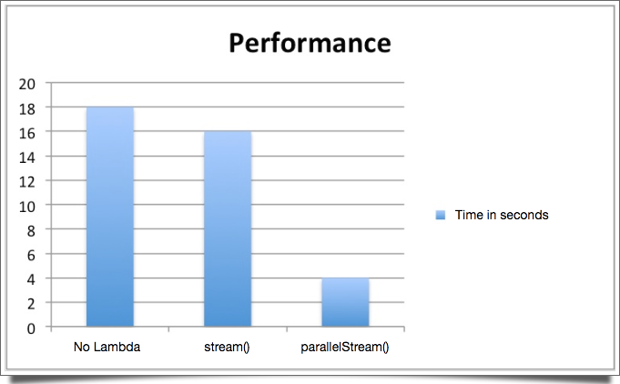
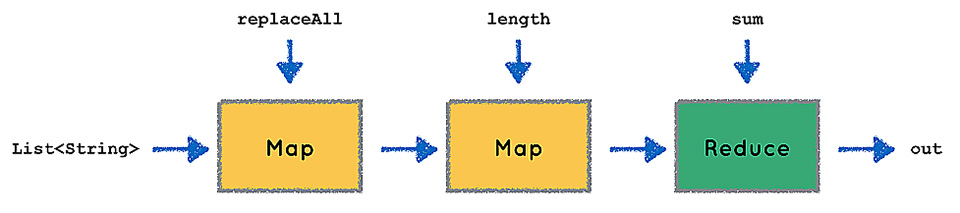

###### Appunti tratti da "Java, The Complete Reference, Ninth Edition" di Herbert Schildt, e altri ottimi articoli [[1]](https://www.javacodegeeks.com/2015/12/functional-vs-imperative-programming-fibonacci-prime-factorial-java-8.html), [[2]](http://www.mokabyte.it/2015/09/java8lambda/) 

# 1. Stream

Gli Stream. La novità più importante della JDK8 insieme alle lambda expressions; ed insieme ad esse costituiscono la
parte più potente e interessante. Proprio per questo motivi, prima di studiare questi appunti, occore aver chiaro
il comportamento dei Generics, le [Collection](Collections-Framework.md), e naturalmente le espressioni [Lambda](Lambda-Expressions.md).

## 1.1 Le Basi

>Uno stream è un passaggio per i dati, rappresentano una sequenza di oggetti. Uno stream opera partendo da una sorgente
dati, come ad esempio un array o una collezione. Di per se, uno stream **non immagazzina nessun tipo di dato**, semplicemente
gli elabora, magari filtrandoli, ordinandoli o altre operazioni sui dati stessi, senza modificare la struttura da cui
provengono i dati.

Nel package *java.util.stream* sono definite le interfacce per la definizione delle API degli stream. Alla base di tutto,
c'è [`BaseStream`](https://docs.oracle.com/javase/9/docs/api/java/util/stream/BaseStream.html) che definisce le 
fondamentali funzionalità di tutti gli stream. BaseStream è una interfaccia generica definita come

```java
interface BaseStream<T, S extends BaseStream<T, S>>
```

Estende `AutoCloseable`, in tal modo gli stream possono essere utilizzati con *try -with-resources*. Generalmente però,
gli stream non hanno la necessità di chiudere la connessione, poiché la maggior parte vengono utilizzati con le collections
e raramente con sorgenti dati in cui occorre terminare la connessione stessa.

| Metodi | Descrizione | 
|---|:---|
| void `close`() | chiude lo stream |
| boolean `isParallel`()| ritorna true se è uno stream parallelo, false se sequenziale |
| Iterator<T> `iterator`() | ottiene una reference ad un iterator per lo stream. *Metodo Terminale* |
| S `onClose`(Runnable handler) | restituisce un nuovo stream con un handler che verrà richiamato alla chiusura dello stream. *Metodo Intermedio* |
| S `parallel`() | restituisce uno stream parallelo, partendo dallo stream su cui il metodo è invocato. *Metodo Intermedio* |
| S `sequential`() | restituisce uno stream sequenziale, partendo dallo stream su cui il metodo è invocato. *Metodo Intermedio* | 
| Spliterator<T> `spliterator`() | ottiene una reference ad uno spliterator per lo stream. *Metodo Terminale* |
| S `unordered`() | restituisce uno stream non ordinato partendo dallo stream su cui il metodo è invocato. *Metodo Intermedio* |

Da BaseStream, discendono svariate altre interfacce di tipo stream, di cui la più generalista è 
[`Stream](https://docs.oracle.com/javase/9/docs/api/java/util/stream/Stream.html)

```java
interface Stream<T>
```

Poiché Stream è di tipo generico, Stream è usata solo per oggetti, e non tipi primitivi. In aggiunta ai metodi ereditati
da BaseStream, ne vengono definiti di ulteriori:

| Metodi | Descrizione |
|---|:---|
|&lt;R, A&gt; R `collect`(Collector&lt;? super T, A, R&gt; collectorFunc)| raggruppa gli elementi all'interno di un container: R specifica il tipo di container ritornato, T il tipo degli elementi dello stream invocante, A il tipo degli oggetti nel container. *Metodo Terminale*|
|long `count`()| Conta il numero di elementi nello stream e restituisce il risultato. *Metodo Terminale* |
|Stream&lt;T&gt; `filter`(Predicate&lt;? super T&gt; pred)| procude uno stream contenente gli elementi dello stream di partenza che soddisfano la condizione specificata da pred. *Metodo Intermedio* |
|void `forEach`(Consumer&lt;? super T&gt; action)| viene eseguito il codice specificato da action per ogni elemento dello stream. *Metodo Terminale* |
|&lt;R&gt; Stream&lt;R&gt; `map`(Function&lt;? super T, ? extends R&gt; mapFunc) |restituisce un nuovo stream con gli elementi modificati dalla funziona mapFunc. *Metodo Intermedio*|
|DoubleStream `mapToDouble`( ToDoubleFunction&lt;? super T&gt; mapFunc)| restituisce un `DoubleStream` contenente gli elementi dello stream di partenza, a cui è stata applicata la funzione mapFunc. *Metodo Intermedio*|
|IntStream `mapToInt`( ToIntFunction&lt;? super T&gt; mapFunc)|restituisce un `IntStream` contenente gli elementi dello stream di partenza, a cui è stata applicata la funzione mapFunc. *Metodo Intermedio*|
|LongStream `mapToLong`( ToLongFunction&lt;? super T&gt; mapFunc)|restituisce un `LongStream` contenente gli elementi dello stream di partenza, a cui è stata applicata la funzione mapFunc. *Metodo Intermedio*|
|Optional&lt;T&gt; `max`( Comparator&lt;? super T&gt; comp)| trova e restituisce il valore massimo tra gli elementi dello stream usando il Comparator passato come attributo per l'ordinamento. *Metodo Terminale*|
|Optional&lt;T&gt; `min`( Comparator&lt;? super T&gt; comp)| trova e restituisce il valore minimo tra gli elementi dello stream usando il Comparator passato come attributo per l'ordinamento. *Metodo Terminale* |
|T `reduce`(T identityVal, BinaryOperator&lt;T&gt; accumulator)|restituisce il risultato dell'operazione accumulator eseguita sugli elementi dello stream. *Metodo Terminale*|
|Stream&lt;T&gt; `sorted`()|restituisce un nuovo stream contenenti gli elementi dello stream di partenza in maniera ordinata. *Metodo Intermedio*|
|Object[] `toArray()`|crea un array partendo dallo stream. *Metodo Terminale*|

Nelle tabelle precedenti, alcuni metodi sono stati annotati come **terminali o intermedi**
- un metodo terminale consuma lo stream, ovvero è usato per produrre un risultato e lo stream non è poi più utilizzabile.
- un metodo intermedio al contrario produce un nuovo stream. Queste operazioni intermedie vanno a creare una catena che
esegue una sequenza di azioni. Queste operazioni non sono eseguite immediatamente, ma quando è richiamata 
una operazione terminale alla fine della catena. Questo meccanismo prende il nome di *lazy behavior* ( comportamento pigro )

Un altro aspetto chiave degli stream è che alcune operazioni intermedie sono definite come **stateless o stateful**
- nelle operazioni stateless, ogni elemento è processato indipendentemente dagli altri ( ad esempio filter() )
- nelle operazioni stateful, l'elaborazione di un elemento dipende dalle proprietà di un altro elemento ( ad esempio sort() )

Questa differenza è particolarmente importante quando si elaborano stream paralleli, poichè una operazione stateful 
potrebbe richiedere più di un passaggio per essere completata.

## 1.2 Come ottenere uno stream

Probabilmente, l'occasione più comune per lavorare con gli stream, è partire da una collezione di oggetti. A partire
dalla JDK8, con l'introduzione dell'interfaccia `Collection`, sono disponibili due metodi per ottenere uno stream a 
partire da una raccolta di oggetti, e poichè tutte implementano tale interfaccia, questi metodi possono essere utilizzati
a partire da qualunque classe che rappresenti una collezione

| Metodo | Descrizione |
|---|:---|
|default Stream<E> `stream`() | restituisce uno stream sequenziale|
|default Stream<E> `parallelStream`() | restituisce uno stream parallelo se possibile |

Uno stream può essere ottenuto anche a partire da un array, utilizzando il metodo statico `stream()` della classe `Arrays`.

Qui di seguito un esempio di quanto detto fino ad ora:

```java
  // Create a list of Integer values.
  ArrayList<Integer> myList = new ArrayList<>( );
  myList.add(7);
  myList.add(18);
  myList.add(10);
  myList.add(24);
  myList.add(17);
  myList.add(5);
  System.out.println("Original list: " + myList);
  // Obtain a Stream to the array list.
  Stream<Integer> myStream = myList.stream();
  // Obtain the minimum and maximum value by use of min(),
  // max(), isPresent(), and get().
  Optional<Integer> minVal = myStream.min(Integer::compare);
  if(minVal.isPresent()) System.out.println("Minimum value: " + minVal.get());
  // Must obtain a new stream because previous call to min()
  // is a terminal operation that consumed the stream.
  myStream = myList.stream();
  Optional<Integer> maxVal = myStream.max(Integer::compare);
  if(maxVal.isPresent()) System.out.println("Maximum value: " + maxVal.get());
  // Sort the stream by use of sorted().
  Stream<Integer> sortedStream = myList.stream().sorted();
  // Display the sorted stream by use of forEach().
  System.out.print("Sorted stream: ");
  sortedStream.forEach((n) -> System.out.print(n + " "));
  System.out.println();
  // Display only the odd values by use of filter().
  Stream<Integer> oddVals = myList.stream()
                                    .sorted()
                                    .filter((n) -> (n % 2) == 1);
  System.out.print("Odd values: ");
  oddVals.forEach((n) -> System.out.print(n + " "));
  System.out.println();
  // Display only the odd values that are greater than 5. Notice that
  // two filter operations are pipelined.
  oddVals = myList.stream()
                    .filter( (n) -> (n % 2) == 1)
                    .filter((n) -> n > 5);
  System.out.print("Odd values greater than 5: ");
  oddVals.forEach((n) -> System.out.print(n + " ") );
  System.out.println();
```

Altri esempi sono inclusi in un [esempio eseguibile](../src/StreamNotes.java) allegato a queste note

## 1.3 Usare gli stream paralleli

Nei moderni processori multicore, l'esecuzione di codice in parallelo significa un notevole incremento delle prestazioni;
implementarlo per gli stream è piuttosto semplice, basta usare uno stream parallelo. Come detto in precedenza, per 
ottenere uno stream parallelo occorre utilizzare il metodo `parallelStream()` definito da `Collection` oppure il 
metodo `parallel()` su uno stream sequenziale ( analogamente il metodo `sequential()` passa da stream parallelo a sequenziale ).



Come regola generale, una operazione su uno stream parallelo deve essere:
- **stateless**: l'operazione non dipende da nessuna informazione di stato precedente
- **non-interfering**: l'operazione non modifica in nessun modo la sorgente dati
- **associative**: l'operazione deve essere associativa, nel senso aritmetico del termine, che significa non ha importanza quale coppia di operatori sono processati per primi

Questi attributi garantiscono che le operazioni su uno stream parallelo genereranno lo stesso risultato che se fossero
eseguite su uno stream sequenziale.

Come ultima proprietà, gli stream paralleli potrebbero non conservare l'ordinamento degli elementi, anche nell'operazione
 `forEach()`. Per preservare l'ordinamento dello stream, si può utilizzare `forEachOrdered()` pagando in prestazioni inferiori

# 2. Operazioni con gli stream

## 2.1 Reduction

Le operazioni finali che restituiscono un risultato basato sugli elementi dello stream sono definite come **operazioni di riduzione**
poichè da uno stream, ritornano un singolo valore. Le API di stream generalizzano questo concetto fornendo 
il metodo [reduce()](https://docs.oracle.com/javase/9/docs/api/java/util/stream/Stream.html#reduce-java.util.function.BinaryOperator-)
che riceve ( in triplo overloading) delle interfacce funzionali che esprimono l'operazione che trasformerà lo stream
in un valore finale

Le operazioni di riduzione devono soddisfare le medesime condizioni definite per gli stream paralleli, ovvero devono essere
stateless, non-interfering, associative.

## 2.2 Mapping

Spesso è utile eseguire delle operazioni sugli elementi di uno stream e porre il risultano in un nuovo stream; queste
operazioni vengono fatte attraverso `map()`, una funzione intermedia che può essere concatenata innumerevoli volte
per creare catene di operazioni sugli elementi, come ad esempio:

```java
//conta il numero di consonanti su una lista di stringhe
//http://www.mokabyte.it/2015/09/java8lambda/
list.stream()
    .map( (p) -> p.replaceAll(“[aeiou]”, “”) )
    .map( (a) -> a.length() ) 
    .reduce( (a, b) -> a + b ) 
    .get(); 
```



Le operazioni di map, devono essere stateless e non-interfering.<br/>
Come argomento map, riceve una interfaccia funzionale che come metodo astratto ha
```java
R apply(T val )
```

Nelle API vengono forniti altri metodi [`flatMap()`](https://docs.oracle.com/javase/9/docs/api/java/util/stream/Stream.html#flatMap-java.util.function.Function-) 
studiati per gestire quelle situazioni in cui ogni elemento
dello stream originario viene mappato in *più di un elemento* nello stream che si vuole creare ( one-to-many transformation ).

## 2.3 Collecting

Come visto fino ad ora, da una collezione è possibile ottenere uno stream ed eseguire operazioni su di esso.
Esiste anche la possibilità di ottenere una collezione da uno stream attraverso il metodo [`collect()`](https://docs.oracle.com/javase/9/docs/api/java/util/stream/Stream.html#collect-java.util.function.Supplier-java.util.function.BiConsumer-java.util.function.BiConsumer-),

# 3. Stile Iterativo vs Funzionale

Per concludere, ho deciso di includere in questi appunti alcune considerazioni prese dalle fonti in testa a questo scritto.
Questo perchè, con l'introduzione delle lambda expression e degli stream, in java 8 si possono fare delle cose davvero interessanti.

>**Imperative programming** is a paradigm where you tell how exactly and which exact statements machine/runtime should execute to achieve desired result.
 
>**Functional programming** is a form of declarative programming paradigm where you tell what you would like to achieve and machine/runtime determines the best way how to do it.

Come riportato dalla [fonte](https://www.javacodegeeks.com/2015/12/functional-vs-imperative-programming-fibonacci-prime-factorial-java-8.html),
lo stile funzionale incoraggiato da java 8 ha aspetti notevoli, riporto ad esempio il codice per calcolare i numeri della
serie di Fibonacci

```java
public class Fibonacci {

    public static void main(String[] args){

        // metodo iterativo
        for(int i = 1; i  <= 12; i++) {
            System.out.print(Fibonacci.get(i) +" ");
            // Output: 1 1 2 3 5 8 13 21 34 55
        }
        
        System.out.println();

        // metodo funzionale. Molto più coiciso e leggibile e non
        // necessita di definire ulteriori metodi
        Stream.iterate( new int[]{1, 1}, fib -> new int[] {fib[1], fib[0] + fib[1]} )
                .mapToInt(fib -> fib[0])
                .limit(12)
                .forEach(fib -> System.out.print(fib + " "));
                // Output: 1 1 2 3 5 8 13 21 34 55 89 144
        
    }
    
    // metodo iterativo
    private static int get(int number) {
        int fib1 = 1;
        int fib2 = 1;
        int fibonacci = fib1;
        for (int i = 2; i < number; i++) {
            fibonacci = fib1 + fib2;
            fib1 = fib2;
            fib2 = fibonacci; 
        }
        return fibonacci; 
    }
}
```


